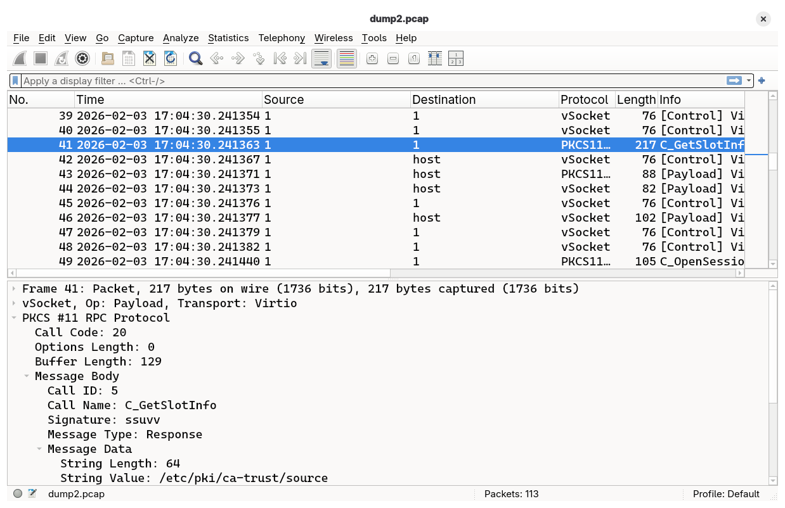

# PKCS #11 RPC Protocol Dissector for Wireshark

A Wireshark dissector plugin for the PKCS #11 RPC [protocol][draft-ueno-pkcs11-rpc] as implemented by [p11-kit][p11-kit].

## Screenshots

<div align="center">
    
</div>

## Features

- Full message header dissection (call code, options length, buffer length)
- Version negotiation detection and parsing
- All 90 PKCS #11 function call mappings
- Type signature parsing with support for:
  - Primitive types (CK_BYTE, CK_ULONG, CK_VERSION)
  - String types (null-terminated, space-padded)
  - Array types (byte arrays, ULONG arrays, attribute arrays)
  - Complex types (CK_MECHANISM, CK_ATTRIBUTE)
  - Buffer types with PKCS #11 variable-length output convention
  - Mechanism parameter updates (Version 2+)
- Automatic request/response detection
- Heuristic dissection for automatic protocol detection
- Human-readable field names and function call display

## Installation

1. Copy `pkcs11-rpc.lua` to your Wireshark personal plugins directory:

   **Linux/macOS:**
   ```bash
   mkdir -p ~/.local/lib/wireshark/plugins
   cp pkcs11-rpc.lua ~/.local/lib/wireshark/plugins/
   ```

   **Windows:**
   ```cmd
   mkdir %APPDATA%\Wireshark\plugins
   copy pkcs11-rpc.lua %APPDATA%\Wireshark\plugins\
   ```

2. Restart Wireshark or reload Lua plugins (Analyze → Reload Lua Plugins)

## Verification

To verify the dissector is loaded:

1. Open Wireshark
2. Go to Analyze → Enabled Protocols
3. Search for "pkcs11" or "rpc"
4. You should see "PKCS11-RPC" in the list

## Usage

### Capturing PKCS #11 RPC Traffic

The easiest way to capture the PKCS #11 RPC protocol is using the
VSOCK transport, even if you are not running a VM.

```bash
# Set up vsockmon interface
$ sudo ip link add type vsockmon
$ sudo ip link set vsockmon0 up

# Start packet capturing
$ sudo tcpdump -i vsockmon0 -w dump.pcap

# Start the server listening on Unix domain socket at $PWD/sock
$ p11-kit server -f -s -p p11-kit-trust.so -n $PWD/sock &

# Forward the traffic through socat
$ sudo socat VSOCK-LISTEN:1111,reuseaddr,fork UNIX-CONNECT:sock
```

Then on the client side:

```bash
$ export P11_KIT_SERVER_ADDRESS='vsock:cid=2;port=1111'
$ sudo -E p11tool --provider /usr/lib64/pkcs11/p11-kit-client.so --list-all pkcs11:
```

### Analyzing Captures

Once you have a capture file:

1. Open the capture in Wireshark
2. Apply the display filter: `pkcs11-rpc`
3. Expand the PKCS11-RPC protocol tree to see:
   - Message header (call code, options, buffer length)
   - Call ID and function name
   - Request/Response signature
   - Parsed message data according to type signature

### Display Filters

Useful Wireshark display filters:

```
# Show all PKCS #11 RPC traffic
pkcs11-rpc

# Show only specific function calls
pkcs11-rpc.call_name == "C_Encrypt"

# Show version negotiation
pkcs11-rpc.version

# Show only requests or responses
pkcs11-rpc.message_type == "Request"
pkcs11-rpc.message_type == "Response"

# Show specific call IDs
pkcs11-rpc.call_id == 30

# Show messages with specific mechanisms
pkcs11-rpc.mech_type == 0x00000001  # CKM_RSA_PKCS

# Show attribute operations
pkcs11-rpc.call_name contains "Attribute"

# Show encryption operations
pkcs11-rpc.call_name contains "Encrypt"

# Show errors
pkcs11-rpc.call_id == 0
```

## Supported Functions

The dissector supports all 90 PKCS #11 functions from 3 protocol versions:

### Version 0 (PKCS #11 2.40)
- C_Initialize through C_WaitForSlotEvent (Call IDs 1-65)
- All session management, object management, cryptographic operations

### Version 1 (PKCS #11 3.0)
- C_LoginUser, C_SessionCancel (Call IDs 66-67)
- Message-based encryption (Call IDs 68-72)
- Message-based decryption (Call IDs 73-77)
- Message-based signing (Call IDs 78-82)
- Message-based verification (Call IDs 83-87)

### Version 2 (Extended)
- C_InitToken2 (Call ID 88) - Space-padded label
- C_DeriveKey2 (Call ID 89) - Returns updated mechanism parameters

## Troubleshooting

### Dissector Not Appearing

1. Check Wireshark version (requires 2.0+)
2. Verify Lua is enabled: Help → About Wireshark → check for Lua version
3. Check for errors: View → Internals → Lua Console
4. Verify file permissions on the plugin file

### Traffic Not Being Decoded

1. Verify the traffic is actually PKCS #11 RPC:
   - Check for 12-byte headers
   - Look for call IDs in valid range (0-89)

2. Use "Decode As" to force dissection:
   - Right-click on packet → Decode As
   - Select PKCS11-RPC protocol

3. Check if heuristic dissector is working:
   - The dissector auto-detects based on message structure
   - For custom ports, manually add: `tcp_port:add(YOUR_PORT, pkcs11_rpc_proto)`

### Incomplete Parsing

1. The protocol uses TCP/stream sockets - ensure you're capturing complete streams
2. Enable TCP reassembly: Edit → Preferences → Protocols → TCP → "Allow subdissector to reassemble TCP streams"

## Contributing

To add support for:

1. **New mechanism parameter structures**: Add parsing in `dissect_signature()` for type `M`
2. **Vendor-specific extensions**: Add new call IDs to `call_names` table
3. **Enhanced attribute display**: Modify attribute parsing to decode specific attribute types

## References

- [p11-kit][p11-kit]
- [draft-ueno-pkcs11-rpc][draft-ueno-pkcs11-rpc]
- [PKCS #11 v2.40](http://docs.oasis-open.org/pkcs11/pkcs11-base/v2.40/)
- [PKCS #11 v3.1](https://docs.oasis-open.org/pkcs11/pkcs11-spec/v3.1/)

## License

This dissector is provided as-is for use with Wireshark.

[draft-ueno-pkcs11-rpc]: https://github.com/ueno/draft-ueno-pkcs11-rpc
[p11-kit]: https://github.com/p11-glue/p11-kit
